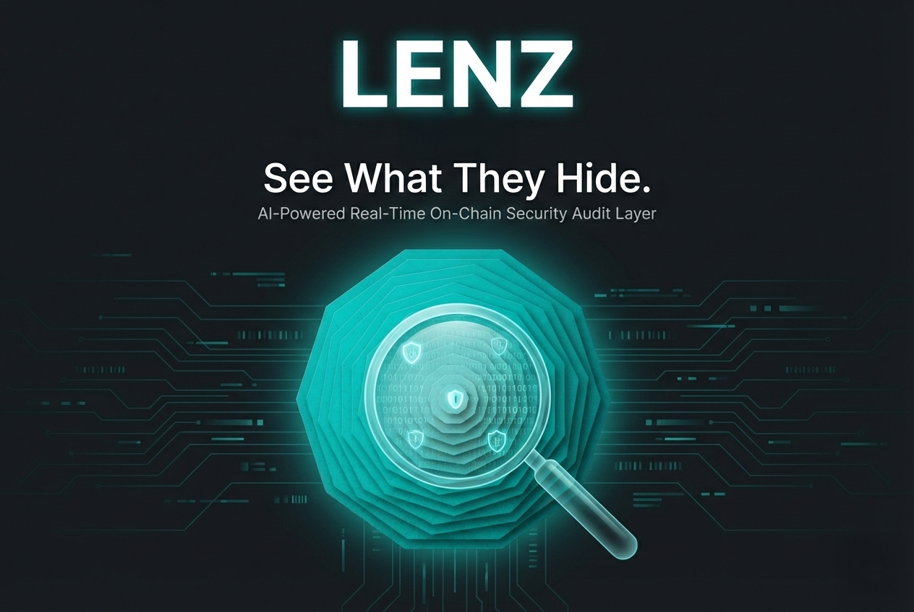

# LENZ: Real-time On-chain Security Audit Layer

<div align="center">
  
  <br />
  <br />
  <p align="center">
    <a href="https://lenz.live"></a>
    <a href="https://twitter.com/lenz_security"></a>
  </p>
  <p align="center">
    
    
    
  </p>
  <p align="center">
    <strong>See What They Hide. Automated Smart Contract Disassembly & Risk Analysis.</strong>
  </p>
</div>

---

## 1. Abstract

**LENZ** is an AI-powered security infrastructure for Solana. It provides real-time disassembly of SBF (Solana Bytecode Format) and heuristic analysis to detect malicious patterns—such as honeypots, hidden mint authorities, and blacklist functions—before users interact with the contract.

Unlike traditional audits that take weeks, LENZ delivers a comprehensive risk score in milliseconds, integrated directly into wallets and DEX interfaces via our SDK.

---
## Architecture

### The "Microscope" Engine (Rust Core)
The core analysis engine, written in pure Rust for performance.
- **SBF Disassembler:** Converts on-chain bytecode back into readable instruction sets.
- **Pattern Matching:** Scans for known malicious signatures (e.g., restricted transfer logic).
- **Heuristic Scorer:** Assigns a risk probability score (0-100) based on control flow analysis.

### Integration Layer
Designed for seamless adoption by wallets and aggregators.
- **Low Latency:** Optimized for sub-50ms response times.
- **Universal Compatibility:** Works with any SPL token or Anchor program.

---
## Usage

### Rust Integration

```rust
use lenz_core::scanner::AuditEngine;

fn main() {
    let program_data = load_program_account();
    let report = AuditEngine::scan(&program_data).unwrap();
    
    if report.risk_score > 80 {
        println!("WARNING: High Risk Detected! Reason: {}", report.primary_risk);
    }
}
```

### TypeScript SDK

```typescript
import { LenzClient } from '@lenz-security/sdk';

const client = new LenzClient(connection);

// Scan a token mint address
const report = await client.scanAddress("TokenMintAddress...");

if (report.isSafe) {
    console.log("Safe to trade.");
} else {
    console.warn("Risk detected:", report.flags);
}
```

---
## Features

* **Instant Audit:** Analyze new token launches immediately upon deployment.
* **Honeypot Detection:** Identifies code logic that prevents selling.
* **Authority Tracking:** Alerts if mint/freeze authorities are still active.
* **Type-Safe SDK:** Complete TypeScript bindings for frontend integration.

---
## Installation

### Core (Rust)
Add the dependency to your `Cargo.toml`:

```toml
[dependencies]
lenz-core = { git = "https://github.com/lenz-security/lenz" }
```

### SDK (TypeScript)
This package is distributed via NPM. It requires Node.js v18+.

```bash
npm install @lenz-security/sdk @solana/web3.js
```

---

## License

Copyright © 2026 LENZ Security Labs.
Released under the **MIT License**.


